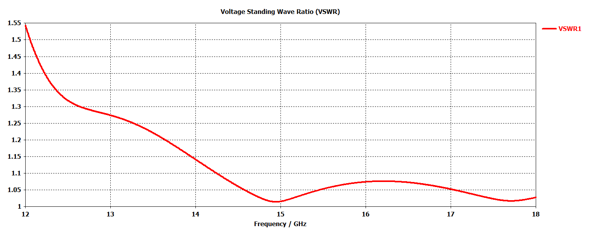

# Design and Simulation of a Conical Wideband Horn Antenna Using CST Software

## Introduction

Horn antennas stand as pivotal components within the realms of wireless communication and radar technology, contributing significantly to the transmission and reception of signals. Their distinctive design, characterized by tapered structures, has enabled them to play a crucial role in directing electromagnetic signals with precision. This paper delves into the fundamental aspects of horn antennas, exploring their design parameters, applications, and the impact of technological advancements.

In this project, We focused on designing a microwave lens, specifically a conical horn antenna. The first step involves evaluating key antenna parameters such as directivity and center frequency, determined by the antenna's dimensions. Following this, We will create the schematic of the design and use CST software to simulate the performance, ensuring optimal results.

## Conical Horn Antenna
### Overview

A conical horn antenna is a type of microwave antenna characterized by its conical shape, which flares out from a smaller base to a larger aperture. This design provides a smooth transition from the waveguide to free space, minimizing reflection and impedance mismatch. Conical horn antennas are known for their high directivity, broad bandwidth, and efficient radiation patterns. They are commonly used in applications requiring precise beam shaping and direction also in point to point communications, such as satellite communication, radar systems, and electromagnetic testing. The conical shape aids in achieving a symmetrical radiation pattern and reduced side lobes, enhancing overall performance. The figure below shows an example of Conical horn Antenna [1].

  

### Conical Geometry and Parameters Evaluation

The conical antenna geometry is illustrated in the figure below. Please note the dimensions labeled on the figure. By using the equations provided with specific values, we can evaluate the directivity according to these values [2].

  

  
$\Large f_c=\frac{1.8412 C}{\pi d}$

 
$\Large \mathrm{~L}=\frac{\frac{d m}{2}-\frac{d}{2}}{\tan \psi_c}$

 
$\Large \mathrm{~d}_{\mathrm{m}}=\sqrt{31 \lambda}$

 
$\Large \text { Gain }=\frac{8 D^2}{\lambda^2}$

Where; $f_c, \mathrm{C}, d, {{\mathrm{L}},} \psi_c \cdot {\mathrm{d}_{\mathrm{m}},} \lambda, \mathrm{l}, \mathrm{D}$ are cutoff frequency of the circular waveguide, speed of light, diameter of the circular waveguide, conical axial length, flare angle, horn aperture, propagation wavelength, flare length, and directivity, respectively.

##Simulation and Results

To ease our project, we will assume the axial length of the conical (L) is 3.25 cm & the diameter of the aperture (dm) is 6 cm with flare angle (\psi) approximately 30 degree & finally the waveguide diameter (d) is 1.566 cm. The figures below illustrate the conical horn model using CST software & the radiation pattern.

  

  

The directivity of this model is 15.6 dB when operate at 15 GHz. Also, the down below figures will show the most important parameters of the model to determine its efficiency.

  

  

The previous figures show the return loss & the VSWR. Note how these values are efficient at 15 GHz which is suitable for point-to-point communication and if we assume the acceptable return loss is approximatly -27 dB then we can say that the bandwidth is can be up to 3 GHz. Figure 13 shows the efficiency of our model.

  

To end up this part we will look at the elevation and azimuth plane of the radiation pattern of our model. Note in upper figure the radiation pattern plotted in elevation plane at \phi = 0 deg & in lower figure the radiation patter plotted in azimuth plane at \theta = 90 deg. Also, note the angular width.

  

  

## Summary

The design section examines key parameters of conical horn antennas, highlighting their use in microwave communication, radar systems, radio astronomy, and scientific research. The simulation section details a conical horn antenna designed for 15 GHz point-to-point communication using CST software. The report anticipates a promising future for horn antennas, with ongoing research and technological advancements expected to enhance their capabilities. This will open new opportunities in 5G communication, remote sensing, and emerging technologies, ensuring horn antennas remain vital in modern communication and sensing systems.

## Simulation Files & Permission

The simulation files are available in this public repository and are free to use without needing permission. If you have any questions, feel free to email me at [mohammad.asaslih@gmail.com](mailto:mohammad.asaslih@gmail.com), and I will do my best to assist you.

## Creators

This project Created by Mohammad Ib. Al-Asaslih. No other individuals contributed to the creation or development of this work.

### Contact Information

- **Mohammad Ib. Al-Asaslih**  
  Email: [mohammad.asaslih@gmail.com](mailto:mohammad.asaslih@gmail.com)  
  Phone: +962-78-250-9494

## References
1. 
Conical horn antennas: View specifications, Designs & More (2021) Millimeter Wave Products | Waveguide Products | MM Wave Components. Available at: https://www.miwv.com/conical-horn-antennas/. 
2. Balanis, C.A. (2016) Antenna Theory Analysis and Design. Newark: John Wiley & Sons, Incorporated. 
